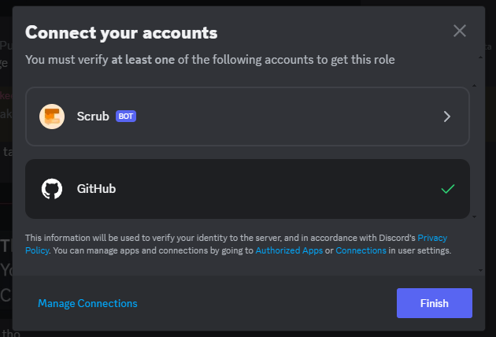

# How to Verify
Hello! Verification may be confusing, so I made this guide to help you out!

- Click on the server name and go to Linked Roles  

- You will then see a singular button. Click it. You will then be taken here:  

- Click on Scrub. You will then be asked to authorize it. You will be taken to this page: 

- Use any of the methods to verify your account. Know that some things **are** broken, so if it didn't work the first time, try again.

Made by [Thandeka](https://github.com/Thandeka0/thandeka0.github.io/scverify.md)
